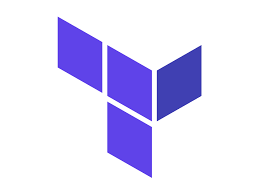

# Fotex Web App

This is a web application or e-commerce app for online distribution business. The purpose of this web application is to facilitate seamless purchase of FOTEX and CANON affiliated products and maintain delivery and purchase history. There are 3 main components, namely Product's Page, Transaction Backend, and Delivery Tracking Service.

### Technologies Used:

        
